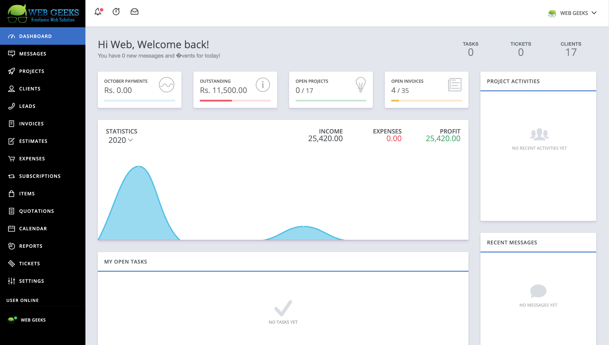
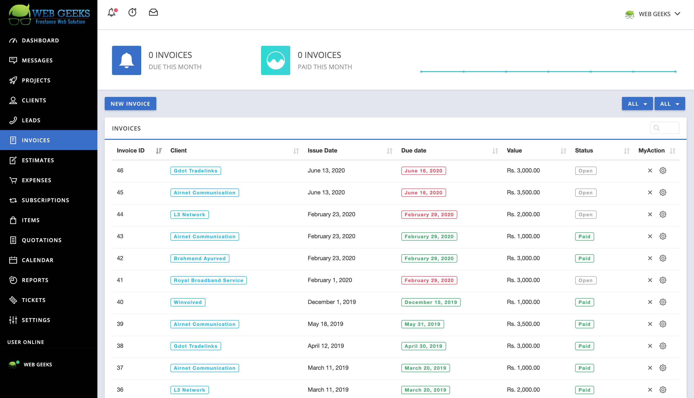

# Free2lance (Project Management Portal) 👨‍💻

Built with PHP Codeigniter

## Prerequisites
- PHP 7.2+
- Mysqli PHP extension
- MBString
- GD
- PDO
- DOM
- CURL
- ZIP
- IMAP
- Allow_url_fopen is enabled!
- Json
- `/files` is writeable
- `/application/migrations` is writeable

## Installation
### Step 1: Environment variables
```bash
cp .env.example .env
```
Update all variables

### Step 2: Update .htaccess
Change `RewriteBase /fc/` to `RewriteBase /<your-installation-dir>/`<br>
or<br>
You can keep it `RewriteBase /`<br>

### Step 3: Run Application
```bash
php -S localhost:8000
```

### Step 4: Run Migrations
Visit this url in browser
```
<your-url>/migrate/now/install/
```

### Step 5: Done. 🍻 

## Screenshots
---



That's all Folks. Enjoy.
